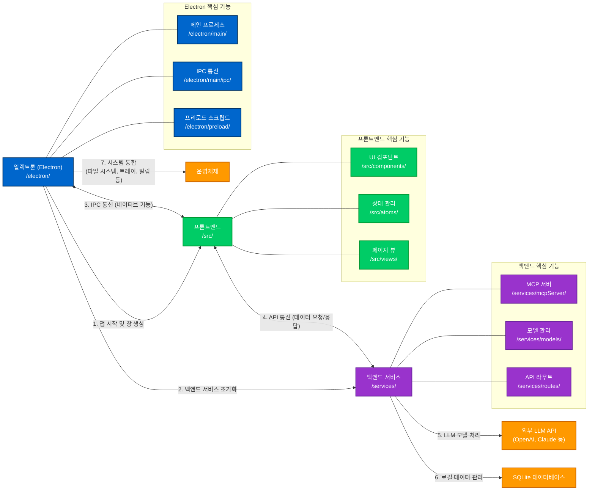
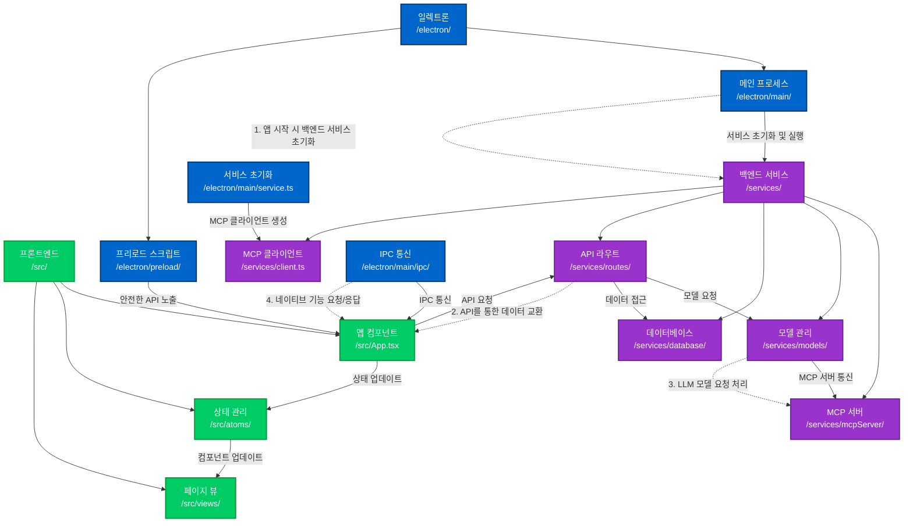
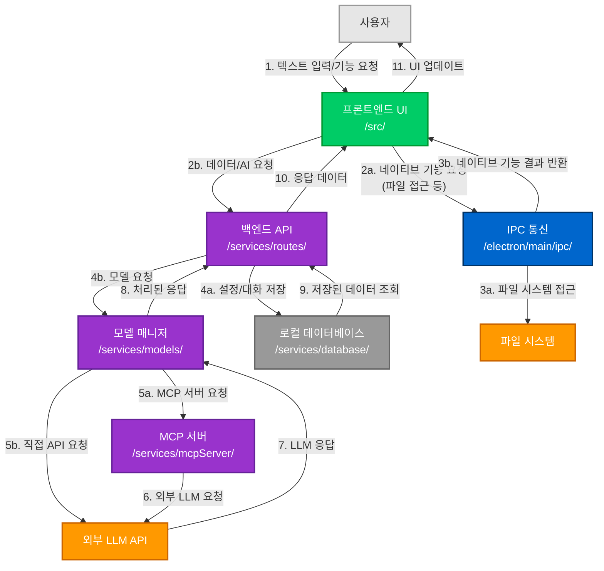

# Dive 프로젝트 아키텍처 구조 설명

이 문서는 Dive 프로젝트의 백엔드, 프론트엔드, 일렉트론 간의 관계를 설명하는 다이어그램과 그에 대한 설명을 담고 있습니다. 프로젝트 구조를 이해하고 커스터마이징하려는 개발자에게 도움이 될 것입니다.

## 목차

- [핵심 아키텍처 관계도](#핵심-아키텍처-관계도)
- [백엔드-프론트엔드-일렉트론 상세 관계도](#백엔드-프론트엔드-일렉트론-상세-관계도)
- [데이터 흐름도](#데이터-흐름도)
- [구성 요소별 역할 설명](#구성-요소별-역할-설명)
- [커스터마이징 가이드](#커스터마이징-가이드)

## 핵심 아키텍처 관계도

### 간단한 설명

이 다이어그램은 Dive의 핵심 구성 요소와 그들 간의 상호작용을 보여줍니다:

1. **일렉트론(Electron)**: 데스크톱 애플리케이션의 기반
2. **백엔드 서비스**: AI 모델 관리와 데이터 처리
3. **프론트엔드**: 사용자 인터페이스

### 주요 흐름 설명

1. **앱 시작 흐름**: 
   - 일렉트론이 애플리케이션을 시작하고 창을 생성합니다.
   - 일렉트론이 백엔드 서비스를 초기화합니다.

2. **통신 흐름**:
   - 프론트엔드와 일렉트론은 IPC(프로세스 간 통신)를 통해 네이티브 기능을 요청/응답합니다.
   - 프론트엔드와 백엔드는 API를 통해 데이터를 주고받습니다.

3. **백엔드 처리 흐름**:
   - 백엔드는 외부 LLM API(OpenAI, Claude 등)와 통신하여 AI 응답을 가져옵니다.
   - 백엔드는 SQLite 데이터베이스에 로컬 데이터를 저장하고 관리합니다.

4. **네이티브 기능**:
   - 일렉트론은 파일 시스템, 시스템 트레이, 알림 등 운영체제 기능과 통합됩니다.

## 백엔드-프론트엔드-일렉트론 상세 관계도

### 간단한 설명

이 다이어그램은 세 가지 주요 구성 요소 내부의 중요한 모듈과 그들 간의 상호작용을 보여줍니다.

### 구성 요소 내부 구조

1. **일렉트론 내부 구조**:
   - **메인 프로세스**: 애플리케이션의 중심 프로세스
   - **IPC 통신**: 렌더러 프로세스와의 통신 관리
   - **프리로드 스크립트**: 보안 API 노출
   - **서비스 초기화**: 백엔드 서비스 시작 관리

2. **백엔드 내부 구조**:
   - **MCP 서버**: 모델 제어 프로토콜 서버
   - **모델 관리**: AI 모델 로딩 및 관리
   - **데이터베이스**: 데이터 저장 및 조회
   - **API 라우트**: API 엔드포인트
   - **MCP 클라이언트**: MCP 서버와의 통신

3. **프론트엔드 내부 구조**:
   - **앱 컴포넌트**: 주요 UI 컴포넌트
   - **상태 관리**: 전역 상태 관리
   - **페이지 뷰**: 화면 구성

### 핵심 상호작용

- **일렉트론 → 백엔드**: 서비스 초기화 및 실행
- **일렉트론 → 프론트엔드**: 안전한 API 노출 및 IPC 통신
- **프론트엔드 → 백엔드**: API 요청
- **백엔드 내부**: 모델 요청, 데이터 접근, MCP 서버 통신
- **프론트엔드 내부**: 상태 업데이트, 컴포넌트 업데이트

## 데이터 흐름도

### 간단한 설명

이 다이어그램은 데이터가 어떻게 시스템을 통해 흐르는지 순차적으로 보여줍니다.

### 데이터 흐름 단계

1. **사용자 입력 단계**:
   - 사용자가 텍스트를 입력하거나 기능을 요청합니다.
   - 프론트엔드 UI가 이 요청을 받습니다.
   - 요청 유형에 따라 IPC(네이티브 기능) 또는 API(데이터/AI)로 전달합니다.

2. **네이티브 기능 처리 단계**:
   - IPC는 파일 시스템 등에 접근하여 기능을 수행합니다.
   - 결과는 UI로 반환됩니다.

3. **AI 처리 단계**:
   - API는 설정이나 대화를 데이터베이스에 저장합니다.
   - 모델 매니저는 MCP 서버를 통해 또는 직접 외부 LLM API와 통신합니다.
   - LLM이 응답을 반환합니다.

4. **응답 반환 단계**:
   - LLM 응답은 모델 매니저를 통해 처리됩니다.
   - 처리된 응답은 API를 통해 프론트엔드로 전달됩니다.
   - 데이터베이스 조회 결과도 API를 통해 프론트엔드로 전달됩니다.
   - UI가 업데이트되어 사용자에게 결과를 보여줍니다.

## 구성 요소별 역할 설명

### 일렉트론 (Electron)

**역할**: 데스크톱 애플리케이션의 네이티브 기능을 제공합니다.

**주요 기능**:
- 운영체제 통합 (파일 시스템, 트레이, 알림 등)
- 창 관리 및 UI 렌더링
- 백엔드 서비스 초기화 및 관리
- 애플리케이션 생명주기 관리

**핵심 디렉토리**:
- `/electron/main/`: 메인 프로세스 코드
- `/electron/preload/`: 프리로드 스크립트
- `/electron/config/`: 애플리케이션 설정

**비유**: 일렉트론은 애플리케이션의 "집"과 같습니다. 기초를 제공하고 다른 부분들이 안전하게 작동할 수 있는 환경을 만듭니다.

### 백엔드 서비스

**역할**: AI 모델 관리, 데이터 처리, API 제공을 담당합니다.

**주요 기능**:
- LLM 모델 로딩 및 관리
- 사용자 요청 처리
- 데이터 저장 및 조회
- API 엔드포인트 제공

**핵심 디렉토리**:
- `/services/models/`: AI 모델 관리
- `/services/database/`: 데이터베이스 작업
- `/services/routes/`: API 엔드포인트
- `/services/mcpServer/`: MCP 서버 관리

**비유**: 백엔드는 애플리케이션의 "두뇌"와 같습니다. 복잡한 처리를 수행하고 데이터를 기억합니다.

### 프론트엔드

**역할**: 사용자 인터페이스를 제공하고 사용자 상호작용을 처리합니다.

**주요 기능**:
- UI 렌더링
- 사용자 입력 처리
- 상태 관리
- 백엔드 및 일렉트론과의 통신

**핵심 디렉토리**:
- `/src/components/`: UI 컴포넌트
- `/src/views/`: 페이지 뷰
- `/src/atoms/`: 상태 관리
- `/src/styles/`: UI 스타일링

**비유**: 프론트엔드는 애플리케이션의 "얼굴"과 같습니다. 사용자와 직접 상호작용하고 정보를 시각적으로 표현합니다.

## 커스터마이징 가이드

### UI 커스터마이징

**수정할 주요 파일 및 디렉토리**:
- `/src/styles/_variables.scss`: 테마 및 브랜딩
- `/src/components/`: UI 컴포넌트
- `/public/image/`: 아이콘 및 이미지
- `/src/views/`: 페이지 레이아웃

**팁**:
- 컬러 스키마, 폰트, 간격 등을 변경하려면 스타일 변수를 수정하세요.
- 새로운 컴포넌트를 추가하려면 기존 컴포넌트를 참고하세요.
- UI 변경은 자체 컴포넌트에 캡슐화하여 유지보수를 쉽게 하세요.

### 기능 커스터마이징

**수정할 주요 파일 및 디렉토리**:
- `/services/models/index.ts`: 모델 통합
- `/services/mcpServer/index.ts`: MCP 도구
- `/services/routes/`: API 엔드포인트
- `/services/prompt/system.ts`: 프롬프트 템플릿

**팁**:
- 새로운 AI 모델을 추가하려면 모델 매니저를 확장하세요.
- 새로운 MCP 도구를 추가하려면 MCP 서버 설정을 수정하세요.
- 새로운 API 엔드포인트는 라우트 디렉토리에 추가하세요.

### 데이터 커스터마이징

**수정할 주요 파일 및 디렉토리**:
- `/services/database/schema.ts`: 데이터 스키마
- `/drizzle/`: 마이그레이션
- `/services/database/index.ts`: 데이터 쿼리

**팁**:
- 새로운 데이터 유형을 저장하려면 스키마를 먼저 수정하세요.
- 스키마 변경 후에는 마이그레이션을 생성하고 실행하세요.
- 복잡한 쿼리는 별도의 함수로 분리하세요.

### 시스템 통합 커스터마이징

**수정할 주요 파일 및 디렉토리**:
- `/electron/main/`: Electron 통합
- `/electron/main/ipc/`: IPC 통신
- `/electron/main/platform/`: 플랫폼별 기능

**팁**:
- 새로운 네이티브 기능은 메인 프로세스에 추가하고 IPC를 통해 노출하세요.
- 플랫폼 특정 기능은 platform 디렉토리에 분리하세요.
- 보안을 위해 프리로드 스크립트를 통해 안전한 API만 노출하세요.

### 국제화 및 현지화

**수정할 주요 파일 및 디렉토리**:
- `/public/locales/`: 번역 파일
- `/src/i18n.ts`: i18n 설정

**팁**:
- 새로운 언어를 추가하려면 locales 디렉토리에 새 폴더를 만드세요.
- 모든 UI 텍스트는 번역 키를 통해 참조하세요.
- 날짜, 시간, 숫자 등의 형식을 현지화하는 도우미 함수를 만드세요.

## 결론

Dive 프로젝트는 일렉트론, 백엔드 서비스, 프론트엔드의 세 가지 주요 구성 요소로 이루어져 있으며, 이들은 서로 협력하여 강력한 AI 데스크톱 애플리케이션을 만듭니다. 각 구성 요소는 명확한 역할과 책임을 가지고 있으며, 이러한 구조는 애플리케이션의 유지보수와 확장을 용이하게 합니다.

커스터마이징을 위해서는 각 구성 요소의 역할을 이해하고, 적절한 파일과 디렉토리를 수정하여 원하는 기능을 추가하거나 변경할 수 있습니다. 프로젝트의 구조를 존중하고 모듈성을 유지하면 앱의 안정성을 해치지 않으면서 커스터마이징이 가능합니다.

---

🤖 이 문서는 Claude Code를 통해 생성되었습니다.

