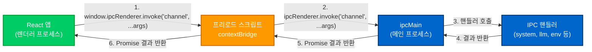
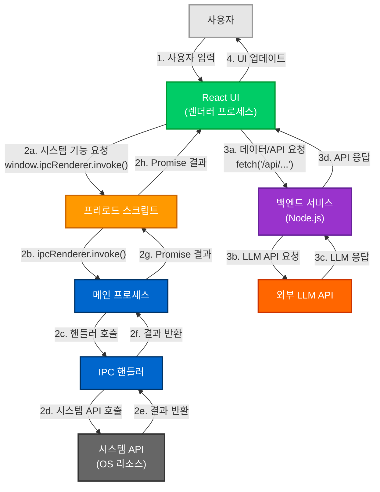

# Electron과 React 통신 가이드

이 문서는 Dive 애플리케이션에서 Electron과 React가 어떻게 통신하는지 설명합니다. Electron 애플리케이션에서 React 프론트엔드와 시스템 리소스 간의 상호작용을 이해하는 데 도움이 됩니다.

## 목차

- [Electron 기본 개념](#electron-기본-개념)
- [Dive 프로젝트의 Electron 구조](#dive-프로젝트의-electron-구조)
- [IPC 통신 메커니즘](#ipc-통신-메커니즘)
- [통신 흐름 시각화](#통신-흐름-시각화)
- [실제 사용 예시](#실제-사용-예시)
- [커스터마이징 가이드](#커스터마이징-가이드)

## Electron 기본 개념

Electron은 웹 기술(HTML, CSS, JavaScript)을 사용하여 데스크톱 애플리케이션을 만들 수 있게 해주는 프레임워크입니다. Electron 애플리케이션은 두 가지 주요 프로세스로 구성됩니다:

### 메인 프로세스 (Main Process)

- Node.js 환경에서 실행
- 시스템 리소스에 직접 접근 가능
- 애플리케이션 생명주기 관리
- 창(window) 생성 및 관리
- 파일 시스템, 네이티브 메뉴 등의 OS 기능 접근

### 렌더러 프로세스 (Renderer Process)

- 웹 브라우저 환경에서 실행 (Chromium 기반)
- 사용자 인터페이스 표시 (React 애플리케이션)
- 보안상의 이유로 시스템 리소스에 직접 접근 불가능
- 메인 프로세스와 통신하여 시스템 기능 사용

이 두 프로세스는 서로 다른 환경에서 실행되므로, 안전하게 통신하기 위해 **IPC(Inter-Process Communication)** 메커니즘을 사용합니다.

## Dive 프로젝트의 Electron 구조

Dive 프로젝트의 Electron 관련 코드는 다음과 같이 구성되어 있습니다:

```
/electron
├── config/                  # 애플리케이션 설정
│   ├── index.ts             # 기본 설정
│   └── keymap.ts            # 단축키 설정
├── main/                    # 메인 프로세스 코드
│   ├── ipc/                 # IPC 핸들러 (메인 프로세스 측)
│   │   ├── env.ts           # 환경 변수 관련 핸들러
│   │   ├── llm.ts           # AI 모델 관련 핸들러
│   │   ├── menu.ts          # 메뉴 관련 핸들러
│   │   ├── system.ts        # 시스템 관련 핸들러
│   │   └── util.ts          # 유틸리티 핸들러
│   ├── platform/            # 플랫폼별 코드 (Windows, macOS 등)
│   ├── index.ts             # 메인 프로세스 진입점
│   └── service.ts           # 백엔드 서비스 초기화
└── preload/                 # 프리로드 스크립트
    └── index.ts             # 프리로드 스크립트 진입점
```

각 디렉토리와 파일의 주요 역할:

- **config/**: 애플리케이션 설정 파일
- **main/**: 메인 프로세스 코드 (시스템 리소스 접근, 창 관리 등)
- **main/ipc/**: IPC 통신을 위한 핸들러 함수들
- **preload/**: 프리로드 스크립트 (보안 경계를 넘어 안전하게 API 노출)

## IPC 통신 메커니즘

Electron에서 메인 프로세스와 렌더러 프로세스 간의 통신은 IPC(Inter-Process Communication)를 통해 이루어집니다. 보안 경계를 안전하게 넘기 위해 **프리로드 스크립트**와 **Context Bridge**를 사용합니다.

### 통신 과정



#### 1. 메인 프로세스의 IPC 핸들러 설정

메인 프로세스는 `ipcMain.handle()` 메서드를 사용하여 IPC 채널을 등록하고 렌더러 프로세스의 요청을 처리합니다:

```typescript
// /electron/main/ipc/system.ts 예시
import { BrowserWindow, ipcMain } from "electron"

export function ipcSystemHandler(win: BrowserWindow) {
  // 자동 실행 설정 가져오기
  ipcMain.handle("system:getAutoLaunch", async () => {
    return store.get("autoLaunch")
  })
  
  // 자동 실행 설정 변경하기
  ipcMain.handle("system:setAutoLaunch", async (_, enable: boolean) => {
    store.set("autoLaunch", enable)
    app.setLoginItemSettings({
      openAtLogin: enable,
      openAsHidden: false
    })
    return true
  })
  
  // 기타 시스템 관련 핸들러...
}
```

#### 2. 프리로드 스크립트의 역할

프리로드 스크립트는 `contextBridge.exposeInMainWorld()`를 사용하여 렌더러 프로세스에서 안전하게 사용할 수 있는 API를 노출합니다:

```typescript
// /electron/preload/index.ts
import { ipcRenderer, contextBridge } from "electron"

contextBridge.exposeInMainWorld("ipcRenderer", {
  // 기본 IPC 함수들
  invoke: (...args) => {
    const [channel, ...omit] = args
    return ipcRenderer.invoke(channel, ...omit)
  },
  
  // 시스템 기능
  getAutoLaunch: () => ipcRenderer.invoke("system:getAutoLaunch"),
  setAutoLaunch: (enable) => ipcRenderer.invoke("system:setAutoLaunch", enable),
  
  // AI 모델 기능
  openaiModelList: (apiKey) => ipcRenderer.invoke("llm:openaiModelList", apiKey),
  // 기타 기능들...
})
```

#### 3. React에서의 IPC 사용

React 코드에서는 `window.ipcRenderer` 객체를 통해 메인 프로세스의 기능을 호출합니다:

```typescript
// React 컴포넌트 예시
async function loadModels() {
  try {
    const results = await window.ipcRenderer.openaiModelList(apiKey)
    if (results.error) {
      throw new Error(results.error)
    }
    setModels(results.results)
  } catch (error) {
    console.error("모델 로딩 실패:", error)
  }
}
```

## 통신 흐름 시각화

IPC 통신을 포함한 Dive 애플리케이션의 전체 통신 흐름은 다음과 같습니다:



### 통신 경로 설명

Dive 애플리케이션에서는 두 가지 주요 통신 경로가 있습니다:

1. **IPC 통신 경로**:
   - React UI → 프리로드 스크립트 → 메인 프로세스 → 시스템 API
   - 주로 시스템 리소스 접근, 설정 관리, 파일 시스템 등에 사용

2. **HTTP 통신 경로**:
   - React UI → 백엔드 서비스 → 외부 API
   - 주로 AI 모델 요청, 데이터 처리 등에 사용

## 실제 사용 예시

### 메인 프로세스에서 IPC 핸들러 정의

```typescript
// /electron/main/ipc/llm.ts
export function ipcLlmHandler(win: BrowserWindow) {
  // OpenAI 모델 목록 가져오기
  ipcMain.handle("llm:openaiModelList", async (_, apiKey: string) => {
    try {
      // OpenAI API 호출하여 모델 목록 가져오기
      const response = await fetch("https://api.openai.com/v1/models", {
        headers: {
          "Authorization": `Bearer ${apiKey}`
        }
      })
      
      if (!response.ok) {
        throw new Error(`API 요청 실패: ${response.statusText}`)
      }
      
      const data = await response.json()
      const models = data.data
        .filter(model => /* 필터링 로직 */)
        .map(model => model.id)
      
      return { results: models }
    } catch (error) {
      return { error: error.message }
    }
  })
  
  // 기타 AI 모델 관련 핸들러...
}
```

### 프리로드 스크립트에서 API 노출

```typescript
// /electron/preload/index.ts
contextBridge.exposeInMainWorld("ipcRenderer", {
  // ...기본 IPC 함수들
  
  // LLM 모델 관련 함수들
  openaiModelList: (apiKey) => ipcRenderer.invoke("llm:openaiModelList", apiKey),
  anthropicModelList: (apiKey, baseURL) => ipcRenderer.invoke("llm:anthropicModelList", apiKey, baseURL),
  ollamaModelList: (baseURL) => ipcRenderer.invoke("llm:ollamaModelList", baseURL),
  // 기타 함수들...
})
```

### React 코드에서 IPC 사용

```typescript
// /src/atoms/interfaceState.ts
export const defaultInterface: Record<InterfaceProvider, InterfaceDefinition> = {
  openai: {
    // ...필드 정의
    model: {
      type: "list",
      label: "Model ID",
      // ...다른 속성들
      listCallback: async (deps) => {
        // IPC를 통해 메인 프로세스 호출
        const results = await window.ipcRenderer.openaiModelList(deps.apiKey)
        if (results.error) {
          throw new Error(results.error)
        }
        return results.results
      },
      listDependencies: ["apiKey"]
    },
  },
  // 다른 인터페이스 정의들...
}
```

### React 앱 초기화에서 IPC 사용

```typescript
// /src/main.tsx
if (window.ipcRenderer) {
  // API 요청을 로컬 백엔드 서비스로 리다이렉트
  const originalFetch = window.fetch
  let port: number | null = null
  
  window.fetch = async (input: RequestInfo | URL, init?: RequestInit) => {
    if (typeof input !== "string" || !input.startsWith("/api")) {
      return originalFetch(input, init)
    }

    // IPC를 통해 백엔드 서비스 포트 가져오기
    port = port ?? (await window.ipcRenderer.port())
    return originalFetch(`http://localhost:${port}${input}`, init)
  }

  // 플랫폼 정보 가져오기
  window.PLATFORM = await window.ipcRenderer.getPlatform() as any
}
```

## 커스터마이징 가이드

Dive 애플리케이션에서 Electron과 React 간의 통신을 커스터마이징하려면 다음 단계를 따르세요:

### 새 IPC 핸들러 추가하기

1. **메인 프로세스에 핸들러 추가**:

```typescript
// /electron/main/ipc/custom.ts
import { BrowserWindow, ipcMain } from "electron"

export function ipcCustomHandler(win: BrowserWindow) {
  ipcMain.handle("custom:doSomething", async (_, arg1, arg2) => {
    // 커스텀 기능 구현
    return { result: "작업 완료" }
  })
}
```

2. **ipc/index.ts에 핸들러 등록**:

```typescript
// /electron/main/ipc/index.ts
import { ipcCustomHandler } from "./custom"

export function ipcHandler(win: BrowserWindow) {
  // 기존 핸들러들...
  ipcCustomHandler(win)
}
```

3. **프리로드 스크립트에 함수 노출**:

```typescript
// /electron/preload/index.ts
contextBridge.exposeInMainWorld("ipcRenderer", {
  // 기존 함수들...
  
  // 새 기능 추가
  doSomething: (arg1, arg2) => ipcRenderer.invoke("custom:doSomething", arg1, arg2),
})
```

4. **React 코드에서 사용**:

```typescript
// React 컴포넌트
async function handleAction() {
  const result = await window.ipcRenderer.doSomething("값1", "값2")
  console.log(result)
}
```

### 타입 안전성 확보

TypeScript를 사용하는 경우, window 객체에 ipcRenderer 타입을 선언하는 것이 좋습니다:

```typescript
// src/vite-env.d.ts 또는 별도의 타입 선언 파일
interface Window {
  ipcRenderer: {
    invoke: (...args: any[]) => Promise<any>
    on: (...args: any[]) => void
    off: (...args: any[]) => void
    
    // 시스템 관련 함수
    getAutoLaunch: () => Promise<boolean>
    setAutoLaunch: (enable: boolean) => Promise<boolean>
    
    // 커스텀 함수
    doSomething: (arg1: string, arg2: string) => Promise<{ result: string }>
    
    // 기타 함수들...
  }
  
  PLATFORM: string
}
```

### 보안 고려사항

IPC 통신을 구현할 때는 다음 보안 사항을 고려하세요:

1. **최소 권한 원칙 적용**: 필요한 기능만 렌더러 프로세스에 노출하세요.
2. **입력 검증**: 모든 IPC 핸들러에서 렌더러 프로세스로부터 받는 모든 입력을 검증하세요.
3. **데이터 필터링**: 민감한 정보는 렌더러 프로세스로 반환하기 전에 필터링하세요.
4. **오류 처리**: 모든 예외를 적절히 처리하고, 상세한 오류 메시지가 노출되지 않도록 주의하세요.

---

이 가이드를 통해 Dive 애플리케이션에서 Electron과 React가 어떻게 통신하는지 이해하고, 필요에 따라 커스터마이징할 수 있습니다. IPC 통신을 활용하면 React 애플리케이션에서 시스템 리소스에 안전하게 접근하면서도 보안을 유지할 수 있습니다.

🤖 이 문서는 Claude Code를 통해 생성되었습니다.
