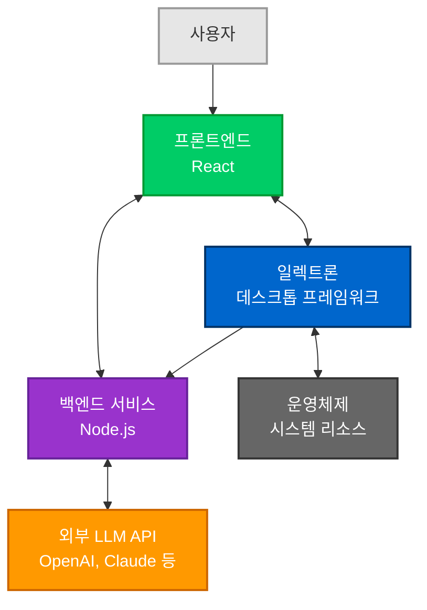
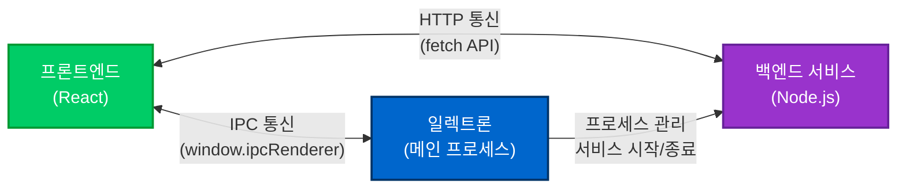
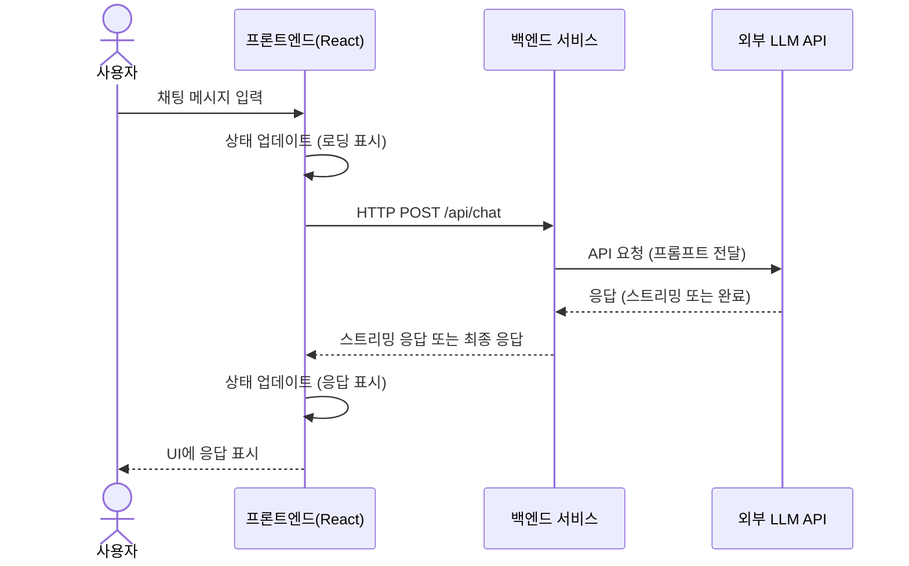
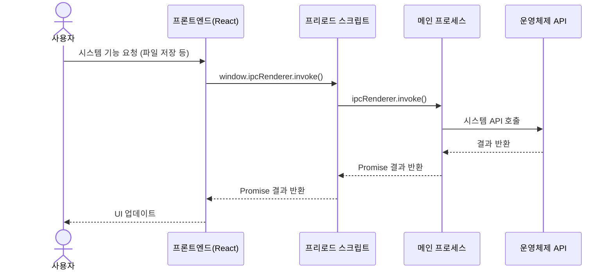

# Dive 애플리케이션 아키텍처 개요

이 문서는 Dive 애플리케이션의 전체적인 아키텍처와 주요 구성 요소 간의 관계를 설명합니다. Dive는 React, 백엔드 서비스, Electron을 결합한 3-티어 아키텍처로 구성된 데스크톱 AI 애플리케이션입니다.

## 목차

- [3-티어 아키텍처 개요](#3-티어-아키텍처-개요)
- [주요 구성 요소](#주요-구성-요소)
- [구성 요소 간 통신](#구성-요소-간-통신)
- [데이터 흐름](#데이터-흐름)
- [아키텍처 시각화](#아키텍처-시각화)
- [확장 및 커스터마이징](#확장-및-커스터마이징)

## 3-티어 아키텍처 개요

Dive 애플리케이션은 세 가지 주요 구성 요소로 이루어진 3-티어 아키텍처를 채택하고 있습니다. 이러한 구조는 각 구성 요소가 자신의 역할에만 집중할 수 있게 해주며, 확장성과 유지보수성을 향상시킵니다.

### 계층 설명

1. **프레젠테이션 계층 (React)**: 사용자 인터페이스와 상호작용 담당
2. **미들웨어 계층 (Electron)**: 시스템 자원 접근 및 데스크톱 통합
3. **비즈니스 로직 및 데이터 계층 (백엔드 서비스)**: AI 모델 처리, 데이터 관리

## 주요 구성 요소

### 1. 프론트엔드 (React)

프론트엔드는 사용자 인터페이스를 담당하며, React와 TypeScript를 사용하여 구현되었습니다.

**위치**: `/src` 디렉토리

**주요 역할**:
- 사용자 인터페이스 렌더링
- 사용자 입력 처리
- 상태 관리
- API 요청 및 응답 처리

**핵심 디렉토리**:
- `/src/components/`: UI 컴포넌트
- `/src/views/`: 페이지 및 화면 구성
- `/src/atoms/`: 상태 관리 (Jotai 사용)
- `/src/hooks/`: 커스텀 React 훅

### 2. 백엔드 서비스

백엔드 서비스는 AI 모델 처리와 데이터 관리를 담당하는 Node.js 기반 서비스입니다.

**위치**: `/services` 디렉토리

**주요 역할**:
- AI 모델 로딩 및 관리
- 외부 LLM API와 통신
- 대화 기록 저장 및 관리
- MCP (Model Control Protocol) 서버 제공

**핵심 디렉토리**:
- `/services/models/`: AI 모델 관리
- `/services/database/`: 데이터 저장 및 조회
- `/services/mcpServer/`: MCP 서버 구현
- `/services/routes/`: API 엔드포인트

### 3. 일렉트론 (Electron)

일렉트론은 데스크톱 애플리케이션 프레임워크로서 시스템 리소스 접근과 창 관리를 담당합니다.

**위치**: `/electron` 디렉토리

**주요 역할**:
- 창 관리 및 렌더링
- 시스템 리소스 접근
- 백엔드 서비스 시작 및 관리
- IPC 통신 처리

**핵심 디렉토리**:
- `/electron/main/`: 메인 프로세스 코드
- `/electron/preload/`: 프리로드 스크립트
- `/electron/main/ipc/`: IPC 핸들러
- `/electron/config/`: 애플리케이션 설정

## 구성 요소 간 통신

Dive 애플리케이션에서 각 구성 요소는 다양한 통신 방식을 사용하여 서로 상호작용합니다.

### 1. React와 Electron 간의 통신

**통신 방식**: IPC (Inter-Process Communication)

**주요 흐름**:
1. React 코드에서 `window.ipcRenderer` 객체를 통해 메인 프로세스의 기능 호출
2. Electron 메인 프로세스에서 `ipcMain.handle()` 메서드로 처리
3. 프리로드 스크립트가 `contextBridge`를 통해 안전한 API 노출

**사용 사례**:
- 파일 시스템 접근
- 애플리케이션 설정 관리
- 시스템 트레이 및 알림 제어
- 윈도우 상태 관리

### 2. React와 백엔드 서비스 간의 통신

**통신 방식**: HTTP REST API

**주요 흐름**:
1. React 앱이 `fetch` API를 사용하여 백엔드 서비스 엔드포인트 호출
2. 백엔드 서비스가 요청을 처리하고 JSON 응답 반환
3. React 앱이 응답을 처리하여 UI 업데이트

**사용 사례**:
- AI 모델 요청 및 응답
- 대화 기록 저장 및 조회
- 사용자 설정 관리
- 파일 업로드 및 다운로드

### 3. Electron과 백엔드 서비스 간의 통신

**통신 방식**: 직접 호출 및 프로세스 관리

**주요 흐름**:
1. Electron 메인 프로세스가 애플리케이션 시작 시 백엔드 서비스 실행
2. 백엔드 서비스가 특정 포트에서 HTTP 서버 실행
3. Electron이 필요시 백엔드 서비스를 재시작하거나 종료

**사용 사례**:
- 애플리케이션 시작/종료 흐름 관리
- 백엔드 서비스 상태 모니터링
- 포트 관리 및 통신 설정
- MCP 클라이언트-서버 통신

## 데이터 흐름

Dive 애플리케이션에서의 주요 데이터 흐름을 설명합니다.

### 채팅 요청 처리 흐름

### 시스템 기능 처리 흐름

## 아키텍처 시각화

아래 다이어그램은 Dive의 전체 아키텍처와 주요 구성 요소 간의 관계를 보여줍니다:

```mermaid
graph TD
    %% 주요 구성 요소
    User["사용자"] 
    Frontend["프론트엔드 (React)<br>/src/"]
    Electron["일렉트론<br>/electron/"]
    Backend["백엔드 서비스<br>/services/"]
    ExternalAPI["외부 LLM API<br>OpenAI, Claude 등"]
    Database["SQLite 데이터베이스"]
    OS["운영체제<br>파일 시스템, 트레이 등"]
    
    %% 프론트엔드 내부 구성 요소
    subgraph "프론트엔드 주요 모듈"
        ReactUI["UI 컴포넌트<br>/src/components/"]
        ReactViews["페이지 뷰<br>/src/views/"]
        ReactState["상태 관리<br>/src/atoms/"]
        ReactHooks["커스텀 훅<br>/src/hooks/"]
    end
    
    %% 백엔드 내부 구성 요소
    subgraph "백엔드 주요 모듈"
        BackendAPI["API 라우트<br>/services/routes/"]
        BackendModels["모델 관리<br>/services/models/"]
        BackendMCP["MCP 서버<br>/services/mcpServer/"]
        BackendDB["데이터베이스 관리<br>/services/database/"]
    end
    
    %% 일렉트론 내부 구성 요소
    subgraph "일렉트론 주요 모듈"
        ElectronMain["메인 프로세스<br>/electron/main/"]
        ElectronIPC["IPC 핸들러<br>/electron/main/ipc/"]
        ElectronPreload["프리로드 스크립트<br>/electron/preload/"]
    end
    
    %% 주요 관계
    User --> Frontend
    Frontend --> Electron
    Frontend --> Backend
    Backend --> ExternalAPI
    Backend --> Database
    Electron --> OS
    Electron --> Backend
    
    %% 내부 모듈 관계
    Frontend --> ReactUI
    Frontend --> ReactViews
    Frontend --> ReactState
    Frontend --> ReactHooks
    
    Backend --> BackendAPI
    Backend --> BackendModels
    Backend --> BackendMCP
    Backend --> BackendDB
    
    Electron --> ElectronMain
    Electron --> ElectronIPC
    Electron --> ElectronPreload
    
    %% 스타일 정의
    classDef user fill:#E6E6E6,stroke:#999999,stroke-width:2px
    classDef frontend fill:#00CC66,color:white,stroke:#009933,stroke-width:2px
    classDef frontendModule fill:#00AA55,color:white,stroke:#007733,stroke-width:1px
    classDef electron fill:#0066CC,color:white,stroke:#003366,stroke-width:2px
    classDef electronModule fill:#0055AA,color:white,stroke:#003377,stroke-width:1px
    classDef backend fill:#9933CC,color:white,stroke:#662299,stroke-width:2px
    classDef backendModule fill:#7722AA,color:white,stroke:#551177,stroke-width:1px
    classDef external fill:#FF9900,color:white,stroke:#CC6600,stroke-width:2px
    classDef db fill:#999999,color:white,stroke:#666666,stroke-width:2px
    classDef os fill:#666666,color:white,stroke:#333333,stroke-width:2px
    
    class User user
    class Frontend frontend
    class ReactUI,ReactViews,ReactState,ReactHooks frontendModule
    class Electron electron
    class ElectronMain,ElectronIPC,ElectronPreload electronModule
    class Backend backend
    class BackendAPI,BackendModels,BackendMCP,BackendDB backendModule
    class ExternalAPI external
    class Database db
    class OS os
```

## 확장 및 커스터마이징

Dive의 3-티어 아키텍처는 애플리케이션의 다양한 부분을 독립적으로 확장하고 커스터마이징할 수 있게 해줍니다.

### 프론트엔드 확장

- **새로운 UI 컴포넌트 추가**: `/src/components/`에 새 컴포넌트 생성
- **새로운 페이지 추가**: `/src/views/`에 새 페이지 컴포넌트 생성 및 라우터 업데이트
- **상태 관리 확장**: `/src/atoms/`에 새로운 상태 정의 추가

### 백엔드 서비스 확장

- **새로운 AI 모델 통합**: `/services/models/`에 새 모델 어댑터 추가
- **새로운 API 엔드포인트 추가**: `/services/routes/`에 새 라우터 추가
- **데이터베이스 스키마 확장**: `/services/database/schema.ts` 수정

### 일렉트론 기능 확장

- **새로운 시스템 기능 추가**: `/electron/main/ipc/`에 새 IPC 핸들러 추가
- **새로운 메뉴 항목 추가**: `/electron/main/menu.ts` 업데이트
- **새로운 단축키 추가**: `/electron/config/keymap.ts` 업데이트

### 모듈 간 통신 확장

- **새로운 IPC 채널 추가**: 메인 프로세스에 핸들러 추가하고 프리로드 스크립트에 노출
- **새로운 API 엔드포인트 추가**: 백엔드에 라우트 추가하고 프론트엔드에서 호출

## 결론

Dive의 3-티어 아키텍처는 현대적인 데스크톱 AI 애플리케이션의 요구사항을 충족하도록 설계되었습니다. 프론트엔드(React), 미들웨어(Electron), 백엔드 서비스의 분리된 구조는 각 구성 요소가 자신의 역할에 집중하게 함으로써 확장성과 유지보수성을 향상시킵니다.

이 구조를 이해함으로써 Dive 애플리케이션의 다양한 부분을 효과적으로 커스터마이징하고 확장할 수 있습니다. 각 구성 요소는 명확한 책임과 경계를 가지고 있으며, 정의된 인터페이스를 통해 서로 통신합니다.

---

🤖 이 문서는 Claude Code를 통해 생성되었습니다.
